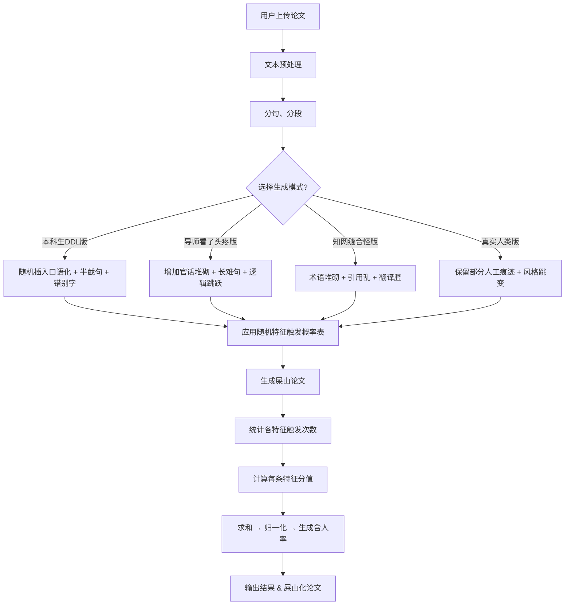

---

# 屎山论文生成 & HumangC 含人率评估体系

## 1️⃣ 屎山论文表格化规则清单

| 维度   | 特征描述     | 生成方法/规则                       | 触发概率/权重 |
| ---- | -------- | ----------------------------- | ------- |
| 语言   | 长难句泛滥    | 句子嵌套 2~4 层，逗号/分号随机插入          | 0.7     |
| 语言   | 官话堆砌     | 插入“综上所述”“值得注意的是”“具有重要意义”等学术套话 | 0.8     |
| 语言   | 逻辑跳跃     | 前后句无衔接，随机连接词“于是”“因此”          | 0.6     |
| 语言   | 口语化      | 偶尔加入“然后然后”“就是说”“好吧”等口语词       | 0.3     |
| 语言   | 重复冗余     | 同一概念重复 1~3 次                  | 0.5     |
| 语言   | 翻译腔/生硬   | 插入直译风格句子，如“该现象显著体现了…”         | 0.4     |
| 逻辑   | 章节混乱     | 章节标题顺序打乱或缺失                   | 0.5     |
| 逻辑   | 论点/论据不匹配 | 论据与论点不相关                      | 0.6     |
| 逻辑   | 跳跃性结论    | 结论提前或突然出现                     | 0.7     |
| 逻辑   | 过度泛化     | 使用“所有学生都…”、“显然…”等绝对化词         | 0.5     |
| 逻辑   | 上下文矛盾    | 前后句内容冲突                       | 0.4     |
| 排版   | 段落长度极端   | 随机生成超长段落或短段落                  | 0.6     |
| 排版   | 排版混乱     | 缩进、空格、换行随机                    | 0.7     |
| 排版   | 符号混用     | 半角/全角标点混合，逗号/分号随机             | 0.5     |
| 引用   | 文献格式乱    | 随机切换 APA/MLA/GB/T             | 0.6     |
| 引用   | 引用错位/缺失  | 文中引用与参考文献不对应                  | 0.5     |
| 引用   | 过度引用     | 插入大量文献引用，堆砌无分析                | 0.4     |
| 学术感  | 术语堆砌     | 插入多余专业术语                      | 0.7     |
| 学术感  | 概念重复     | 同义词替换：方法/手段/途径                | 0.6     |
| 学术感  | 空洞引用     | 文中“已有研究表明…”但无数据               | 0.5     |
| 学术感  | 泛泛结论     | “研究具有参考价值”，“未来可探索”            | 0.5     |
| 人工痕迹 | 错别字/typo | 随机替换字符、拼写错误                   | 0.6     |
| 人工痕迹 | 拼写错误（英文） | 英文单词大小写/拼写随机                  | 0.4     |
| 人工痕迹 | 格式不一致    | 列表/标题/段落风格不统一                 | 0.5     |
| 人工痕迹 | 半截句      | 插入句子中断：“本研究的结果显示……并且……”       | 0.6     |
| 人工痕迹 | 拖延痕迹     | 风格突然跳变，口语化                    | 0.5     |
| 人工痕迹 | 占位符      | 插入“此处待补充”“见图表”等               | 0.4     |

---

## 2️⃣ 含人率计算表 + 特征权重

**规则说明**：

* 含人率 = 论文里“人工痕迹分 / 最大可能分值”，归一化到 0~100%
* 每条特征按权重和触发次数计算分值

| 特征       | 权重  | 计量方式          | 示例分值贡献      |
| -------- | --- | ------------- | ----------- |
| 错别字/typo | 0.6 | 检测到 typo 数量   | 10 次 → 6 分  |
| 半截句      | 0.7 | 句子不完整/中断      | 3 次 → 2.1 分 |
| 官话堆砌     | 0.8 | 套话出现次数 / 总句数  | 5 次 → 4 分   |
| 口语化      | 0.5 | 口语词出现次数 / 总词数 | 6 次 → 3 分   |
| 长难句      | 0.7 | 嵌套句子数 / 总句数   | 4 次 → 2.8 分 |
| 逻辑跳跃     | 0.6 | 前后句语义相似度低     | 3 次 → 1.8 分 |
| 排版混乱     | 0.5 | 随机段落长度异常/标点混用 | 2 次 → 1 分   |
| 引用混乱     | 0.5 | 文献格式/缺失问题     | 2 次 → 1 分   |
| 术语堆砌     | 0.6 | 无意义术语出现       | 3 次 → 1.8 分 |

> **含人率计算示例**：
>
> ```
> 总分 = 6+2.1+4+3+2.8+1.8+1+1+1.8 = 23.5
> 最大可能分 = 35
> 含人率 = 23.5 / 35 ≈ 67%
> ```

---

## 3️⃣ 屎山论文生成 + 含人率算法流程图（Markdown Mermaid）



---

### 🔹 使用说明

1. **特征触发概率表**可以调节不同模式生成的风格差异
2. **含人率**只基于规则和人工痕迹统计，不依赖任何 AI 检测器
3. 算法可直接用 Python 实现：

   * 分句、分段 → 检测特征 → 触发权重 → 求和 → 归一化
4. 屎山论文与含人率可以同时输出给排行榜或倒闭进度条功能

---
